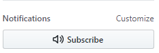

## Foro de consultas PdeP - Viernes Noche
En este foro vamos a manejar consultas prácticas para la materia Paradigmas de programación, a través de issues que todos pueden abrir.
### Docente: [**Valeria Pennella**](https://github.com/vpennella)
### Ayudantes: [**Andrés Skrzyniecki**](https://github.com/skrzynieckiUTN) y [**Brian Monroy**](https://github.com/brianUtn98)

## Utilización

Cuando tengas una duda, primero buscá en los [**issues cerrados**](https://github.com/brianUtn98/ModeloForo/issues?q=is%3Aissue+is%3Aclosed) a ver si fue respondida antes. ¡La idea del foro es que una duda tuya, puede ser la duda de alguien más! Si ninguno de los issues cerrados te la resuelven, fijate en los [**issues abiertos**](https://github.com/brianUtn98/ModeloForo/issues?q=is%3Aopen+is%3Aissue) a ver si alguien lo preguntó antes que vos y está esperando por la respuesta. (Podés suscribirte a ese issue para que Github te avise si alguien responde con el botón suscribe).
- 
Si nada del foro responde tu consulta, o es muy específica, podes abrir un nuevo issue describiendo detalladamente tu duda/problema, y esperar a que te respondamos.
- 
Procurá que la información sea clara y detallada, y en caso de hacer mensión a un error intentar copiarlo de alguna manera para que sea más fácil entenderlo. Podes agregar pequeñas porsiones de código que te "pinchen", pero no nos muestres el TP ¡Todos pueden verlo! Además para eso están las correcciones.

### Links útiles:
* Si tenés dudas con la teoría (o también la práctica), podés visitar la sección de [**apuntes**](http://www.pdep.com.ar/material/apuntes) en [**pdep**](http://www.pdep.com.ar/).
* ¿Estás preparandote para el parcial? Podés practicar con los [**parciales**](http://www.pdep.com.ar/material/parciales) y [**finales**](http://www.pdep.com.ar/material/finales) que la cátedra tiene subidos a su página. Algunos están resueltos.
* Si queres repasar el uso de algunas herramientas, y algunos temas específicos de la materia, fijate si encontras algo en los [**videos**](http://www.pdep.com.ar/material/videos) subidos.
* Visitá a nuestro querido [**mumuki**](https://mumuki.io/pdep-utn/chapters/435-programacion-funcional)
